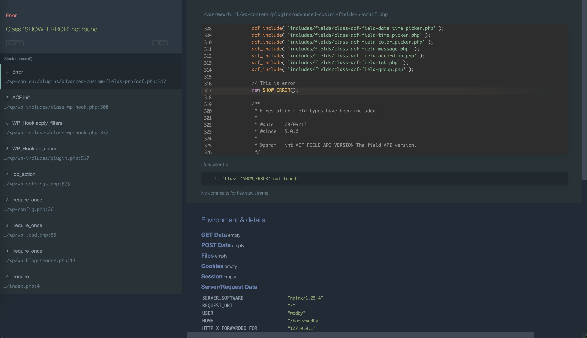
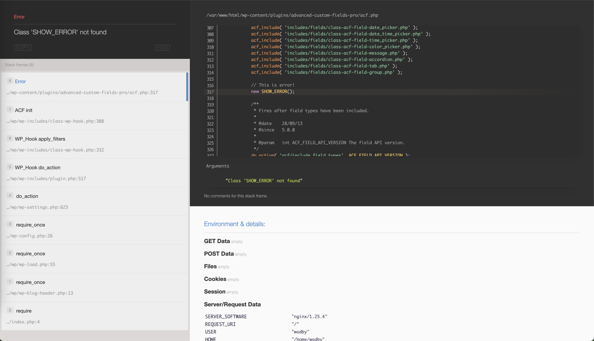

# Whoops WordPress error handler
Whoops PHP error handler for WordPress.   
It catches fatal _errors_ and _exceptions_ and shows in beautiful format.
We can see a stack trace and parts of invocable code and we can go through the stack trace to see the called parts in the code.  
In the debug information we can find GET, POST, Files, Cookie, Session, Server/Request Data, Environment Variables.


## How to install WordPress error handler
1. Create `mu-plugins` directory.
    ```bash
    mkdir wp-content/mu-plugins
    ```

2. Download release and unzip `Whoops WP error handler` in `mu-plugins/mu-plugins`.
   ```bash

   ```

3. Create the file `mu-plugins/mu-plugins/whoops-error-handler.php` and include general file of plugin
```php
require_once __DIR__ . '/whoops-error-handler/whoops-error-handler.php';
```


## Available themes
To use one of the themes add a const `RD_WHOOPS_THEME` to the `wp-config.php`

**Smooth material dark**
```php
const RD_WHOOPS_THEME = 'material-dark-smooth';
```


**Material dark**
```php
const RD_WHOOPS_THEME = 'material-dark';
```


**Gray**
```php
const RD_WHOOPS_THEME = 'gray';
```


**Original optimized**
```php
const RD_WHOOPS_THEME = 'original-optimized';
```



**Original Default**
```php
const RD_WHOOPS_THEME = 'default-original';
```

