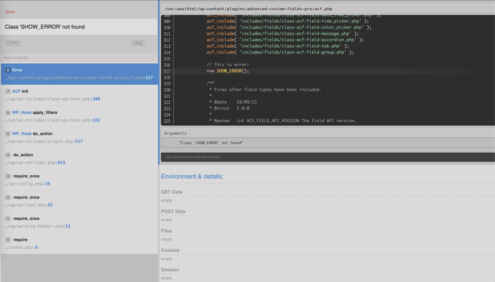

# Whoops WordPress error handler

Whoops PHP error handler for WordPress with different themes.  
It catches fatal _errors_ and _exceptions_ and shows in beautiful format.
We can see a stack trace, go through the stack trace to see the called parts in the code.  
In the debug information we can find GET, POST, Files, Cookie, Session, Server/Request Data, Environment Variables.


## How to install WordPress error handler

1. Require via Composer

   ```bash
   composer require renakdup/whoops-wordpress-error-handler
   ```

   Or if you want to use it just for local environment

   ```bash
   composer require renakdup/whoops-wordpress-error-handler --dev
   ```

2. Create a file of mu-plugin by the address `wp-content/mu-plugins/mu-plugins/whoops-error-handler.php`:
    ```bash
    mkdir wp-content/mu-plugins
    touch wp-content/mu-plugins/whoops-error-handler.php
    ```

3. Add the calling code to the file
   ```php
   <?php
   // This checks necessary if you use the package as a dev dependency
   if ( ! class_exists( Pisarevskii\WhoopsErrorHandler\ErrorHandler::class ) ) {
        return;
   }
   
   $error_handler = new Pisarevskii\WhoopsErrorHandler\ErrorHandler();
   $error_handler->init();
   ```

**That's it!**

## How to configure

### Showing conditionals

By the default _error handler_ isn't displayed for `wp_get_environment_type() === 'production'`.   
If you want to exclude additional envs, you should use the filter:

```php
add_filter( 'pisarevskii/whoops-error-handler/prohibited-envs', function ( $defaults ) {
	return array_merge( $defaults, [ 'staging', 'development' ] );
}, 10, 1);
apply_filters( "pisarevskii/whoops-error-handler/prohibited-envs", [ "production" ] );
```

---
If you want to disable _error handler_ for some special conditionals then use this filer:

```php
add_filter( 'pisarevskii/whoops-error-handler/not-enable', function ( $default ) {
	if ( ! WP_DEBUG || ! WP_DEBUG_DISPLAY ) {
		return true;
	}
}, 10, 1);
```

### Themes

To use one of the available themes, you can pass theme's name while instantiating object.

```bash
 $error_handler = Pisarevskii\WhoopsErrorHandler\WhoopsErrorHandler( 'gray' );
```

## Available themes

**Smooth material dark**


```php
$name = 'material-dark-smooth';
```

---

**Material dark**


```php
$name = 'material-dark';
```

---

**Gray**



```php
$name = 'gray';
```

---

**Original optimized**


```php
$name = 'original-optimized';
```

---

**Original Default**


```php
$name = 'default-original';
```